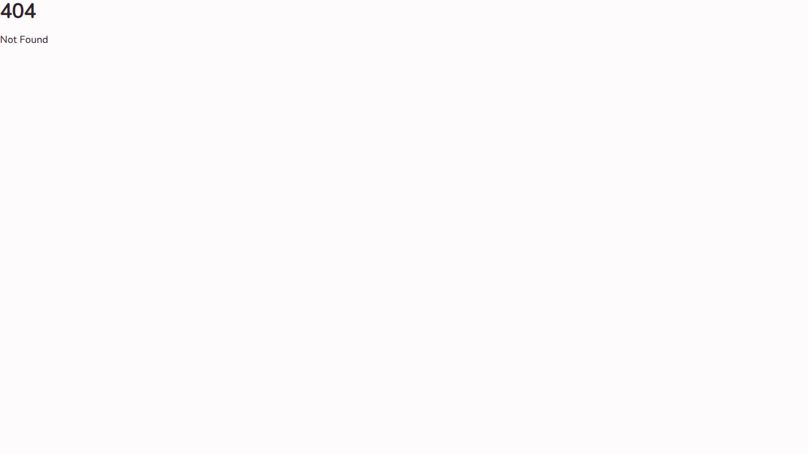

# UI Redesign Screenshots

This directory contains screenshots showcasing the major UI redesign introduced in this PR.

## Overview

This PR introduces a complete UI redesign of the Baby Tracker application with:

- **New Token-Based CSS System**: Implemented with CSS custom properties for theming
- **Multiple Themes**: Light, Dark, Night, and Grey themes
- **Modern Component Library**: New reusable components built with Svelte 5
- **Improved Layout**: Streamlined navigation and better information architecture
- **Enhanced Charts**: New SVG-based chart components for insights

## Screenshots

### Landing Page

The redesigned landing page with modern styling and clear call-to-action.

### Dashboard

The main dashboard featuring:

- **TrackTile** components for quick session tracking
- **TimerHero** for active timer display
- **ActiveTimerBar** floating mini-timer
- Clean, touch-friendly interface

### History

Redesigned history page with:

- **SessionRow** components with swipe actions
- **SessionEditSheet** for editing sessions
- Date-grouped session list
- Improved readability

### Stats/Insights

New insights page featuring:

- 4 tabbed sections
- **BarChart**, **StackedBar**, and **Timeline** components
- Better data visualization
- Sleep position balance warnings

### Family

Redesigned family page with:

- Merged babies and family management
- **BabySelector** component
- Improved family member management

### Settings

Updated settings page with:

- Theme picker with visual preview
- Cleaner layout
- Better organization of options

## Key Components Added

### UI Components

- `AppBar.svelte` - Top navigation bar
- `BottomNav.svelte` - Updated with lucide icons
- `Button.svelte` - Reusable button component
- `Icon.svelte` - lucide-svelte wrapper
- `OptionGrid.svelte` - Large-target selector
- `Sheet.svelte` - Bottom sheet component
- `TrackTile.svelte` - Dashboard tracking tiles
- `BabySelector.svelte` - Baby selection component

### Timer Components

- `TimerHero.svelte` - Active timer hero display
- `ActiveTimerBar.svelte` - Floating mini-timer
- `active-timers.svelte.ts` - Centralized timer state management

### Session Components

- `SessionRow.svelte` - Session list item with swipe actions
- `SessionEditSheet.svelte` - Edit session bottom sheet

### Chart Components

- `BarChart.svelte` - Bar chart visualization
- `StackedBar.svelte` - Stacked bar chart
- `Timeline.svelte` - Timeline visualization

## Removed Components

Legacy components replaced by the new design:

- `SessionList.svelte` → `SessionRow.svelte`
- `SessionCard.svelte` → `SessionRow.svelte`
- `Nav.svelte` → `AppBar.svelte`
- `Timer.svelte` → `TimerHero.svelte`
- `SleepTimerCard.svelte` → `TrackTile.svelte`
- `FeedingTimerCard.svelte` → `TrackTile.svelte`
- `BreastPumpTimerCard.svelte` → `TrackTile.svelte`
- `SideToggle.svelte` → Integrated into new components

## CSS Architecture

The new design uses a token-based CSS system:

- `tokens.css` - Core design tokens
- `themes.css` - Theme-specific color schemes
- `open-props` - CSS design system foundation
- `lucide-svelte` - Icon library

## State Management

New state management with Svelte 5 runes:

- `time.svelte.ts` - Shared time tick store (1s interval)
- `theme.svelte.ts` - Theme state management
- `active-timers.svelte.ts` - Timer state factory

## Testing

All Playwright tests have been updated to work with the redesigned UI, including:

- Updated selectors for new components
- Adjusted expectations for new flows
- Reduced timeout from 30s to 15s for faster test execution
